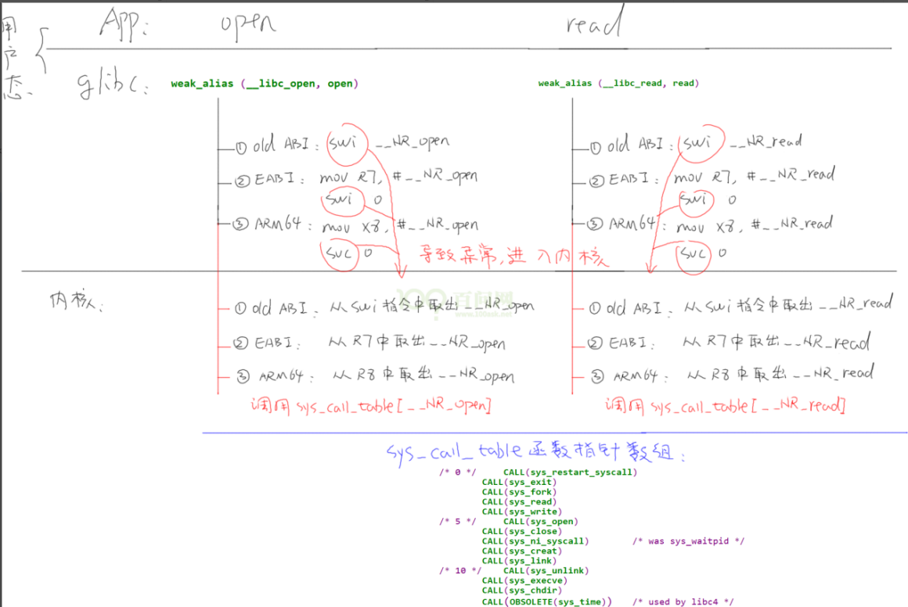
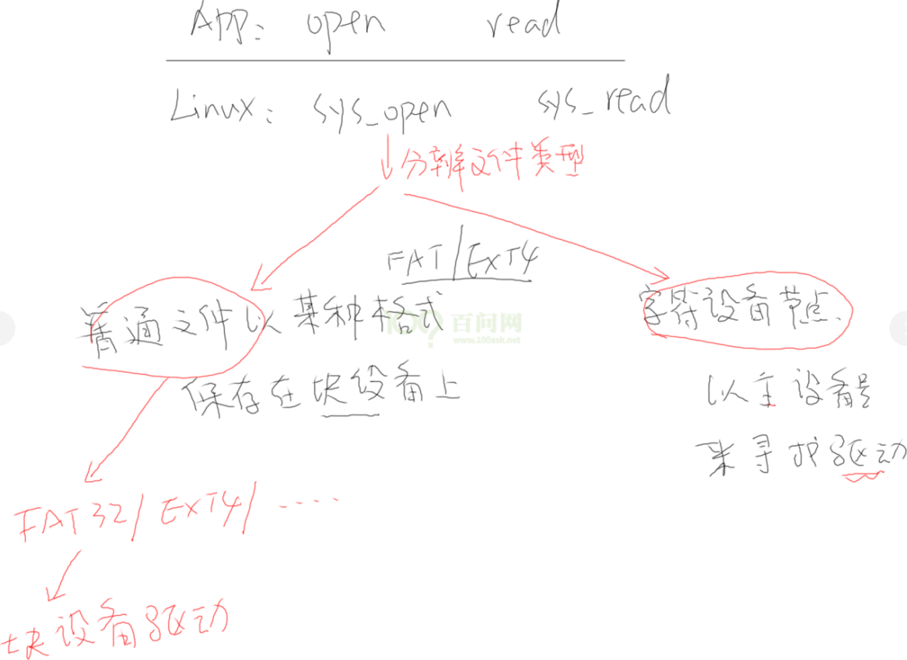

## 说明
> 本文档整理韦东山Linux教程**文件IO**小节知识点；

在Linux系统中，普通文件、驱动程序等都是通过“文件IO”来操作的，而文件IO又是通过：`open/read/write/lseek/close`等通用IO接口进行操作；

```
/**
 * @brief   打开文件 
 * @param   pathname：文件所在路径    
 * @param   flags：文件权限（O_WRONLY,O_RDONLY,O_RDWR等）
 * @param   mode：创建文件时使用，为新创建的文件分配权限（S_IRUSR，S_IWUSR等）
 * @retval  成功则返回文件描述符，否则返回-1
 * @note    可以借助man手册查看命令用法，例如：man 2 open    
 */
int open(const char *pathname, int flags);

/**
 * @brief   关闭文件      
 * @param   fd：文件描述符
 * @retval  关闭文件结果
 */
int close(int fd);

/**
 * @brief   向文件中写数据 
 * @param   fd：文件描述符
 * @param   buf：存储要写入的数据
 * @param   count：写入的长度，以字节为单位     
 * @retval  写入成功时，返回写入的字符长度，否则返回-1
 */
ssize_t write(int fd, const void *buf, size_t count);

/**
 * @brief   读文件中数据
 * @param   fd：文件描述符
 * @param   buf：存储要读入的数据
 * @param   count：读出的长度，以字节为单位     
 * @retval  读成功时，返回读出的字符长度，否则返回-1
 */
ssize_t read(int fd, void *buf, size_t count);

/**
 * @brief   修改文件偏移量
 * @param   fd：文件描述符
 * @param   offset：将要偏移的字节数
 * @param   whence：从哪个位置开始偏移
             - SEEK_END 文件末尾
             - SEEK_CUR 当前偏移量位置
             - SEEK_SET 文件开头位置             
 * @retval  
 */
off_t lseek(int fd, off_t offset, int whence);
```


### 接口调用流程


应用程序直接操作的open/read等接口，实际上是调用了**glibc(c运行库)**，在glibc中会根据不同的硬件处理器，产生**swi**或**svc**异常到Linux内核，同时open/read等不同的操作，会向内核传入不同的参数，最终在内核中调用**sys_open**、**sys_read**对文件进行操作；


内核操作函数会根据文件类型，判断是属于 **字符设备驱动** 还是 **块设备驱动**。对于字符设备驱动，以**主设备号**来寻找驱动，以**次设备号**来寻找硬件；而对于块设备驱动，首先需要判断文件的格式，然后再调用块设备驱动。
